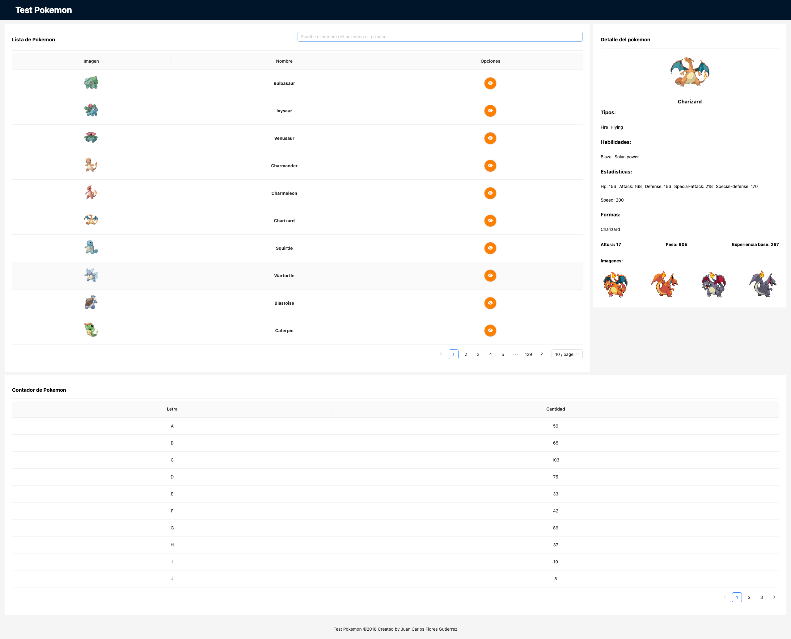

# Test-Pokemon-Defontana

## Description
This is a test for DeFontana company. It is a simple web app that shows a list of pokemons and their details. 
It is made with React.js and Typescript. It uses the [PokeAPI](https://pokeapi.co/) to get the data. 
## Clone the repository
```
git clone https://github.com/JCFlores915/test-pokemon-defontana.git
cd test-pokemon-defontana
```

## Project setup
```
npm install
```

## Compiles and hot-reloads for development
```
npm run dev
```

## Features
- List of pokemons
- Pokemon details
- Search Pokemon by name
- Counter of pokemons in the list

## Screenshots


## Technologies
- Vite
- React.js
- Typescript
- Axios
- Ant Design

## Author
- Juan Carlos Flores Gutierrez


